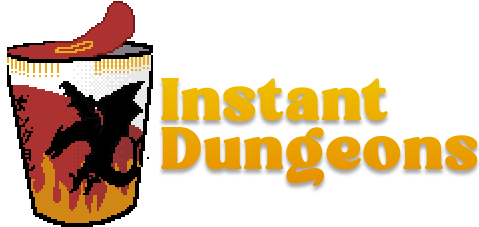

  

<h3 align="center">Instant Dungeons</h3>

  

Have you ever found yourself in need of a quick plot hook for your tabletop role-playing game? Did you spend your week procrastinating on your campaign and now you need to come up with something on the fly? Instant Dungeons is a web application that utilizes AI to generate plot hooks on the go for tabletop role-playing games. 🎲
     
     
    <a href="https://instant-dungeons.vercel.app/" target="_blank"><strong>Go to Demo Website »</strong></a>

> **Note:** This project is currently under development. Stay tuned for updates and new features! 🚧

## Roadmap

- [x] AI-powered plot hook generation 🧙‍♂️📚
- [x] Mobile responsiveness 📱
- [ ] Random plot hook generator: Because sometimes you don't even care anymore 🤷‍♂️🎲
- [ ] Customizable options: Tailor the generated plot hooks to fit your campaign's setting, genre, and themes.🌍🔮
- [ ] Expand the plot hook: Generate additional details and ideas for a given plot hook. 📝
- [x] Save generated plot hooks. 💾📋
- [ ] Shareable links: Share generated plot hooks with your friends and fellow players. 📤🔗

> **Note 2:** At the time of writing, Google's Gemini AI is the primary model used for plot hook generation, meaning that we are limited to 60 requests per minute. If you encounter any issues with the plot hook generation, please try again in a few minutes. A solution to this limitation may eventually come. 🤖

## Contributing

Contributions are welcome! If you have any ideas, suggestions, or bug reports, please open an issue or submit a pull request. Let's make InstantDungeons even better together! 🚀🤝

1. Fork the Project
2. Create your Feature Branch (git checkout -b feature/AmazingFeature)
3. Commit your Changes (git commit -m 'Add some AmazingFeature')
4. Push to the Branch (git push origin feature/AmazingFeature)
5. Open a Pull Request

## Contact

Tomas Vilalta - tomasfedericovilalta@gmail.com

Project Link: [https://github.com/github_username/repo_name](https://github.com/TomasVilalta/instant-dungeons)

(<a href="#readme-top">back to top</a>)

## Acknowledgments

- Thanks [Othneildrew](https://github.com/othneildrew) for the README template! 🦖
